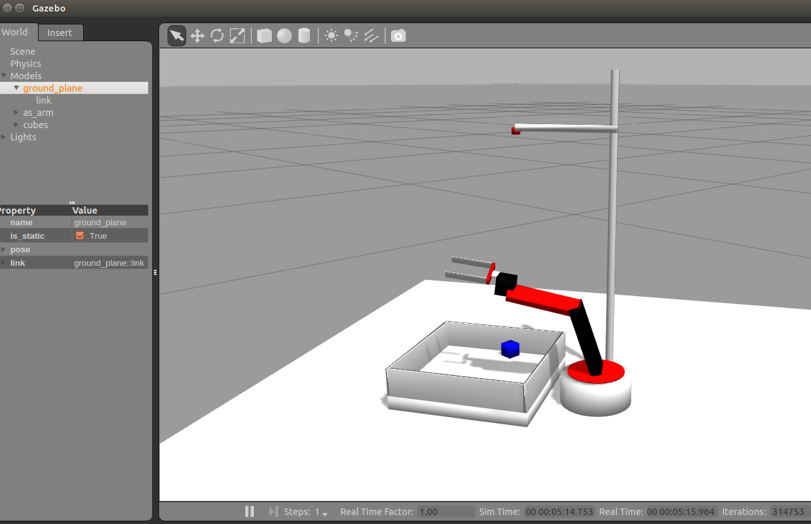
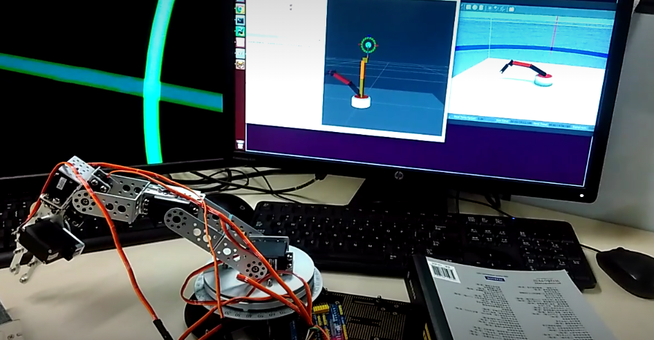

#### Gazebo 展示
  

#### Real环境展示
  

## URDF描述文件
* 机械臂相关描述文件位于 _as_arm_description/urdf_ 目录中
    * as_arm.xacro 为机械臂描述文件
    * camera.xacro 摄像机和机架描述文件
    * sink.xacro 物品槽描述文件

## Launch启动相关命令：
* 启动gazebo仿真环境：
    * roslaunch as_arm_gazebo as_arm_bringup.launch
* 启动moveit Demo：
    * roslaunch as_arm_moveit_config demo.launch
* 启动grasp 生成器
    * roslaunch as_arm_gazebo grasp_generator_server.launch
* 查看摄像头图像：
    * rosrun image_view image_view image:=/camera/image_raw
* 控制某个joint移动角度：
    * rostopic pub -1 /rrbot/joint1_position_controller/command std_msgs/Float64 "data: 1.5"
* 获取cube位置
    * rostopic echo -n 1 /gazebo/cubes

* 获取joint位置：
    * rostopic echo -n 1 /as_arm/joint_states
* 获取某个link(如end effector)的世界坐标
    * rosrun tf tf_echo /world /grasp_frame_link
    
## 碰撞检测相关
* 碰撞检测包含self-collision和environment-collision两种，相关文件如下：
    * Service描述文件： as_arm_description/srv/CheckCollisionValid.srv
    * Service服务文件（需要在catkin环境编译）： as_arm_control/src/check_collision.cpp
    
## 仿真环境运行：
* 相关控制脚本位于 _as_arm_control/test/_目录中
    * 抓取脚本: pick_and_place.py
    * moveit运动规划： test_planner.py
* 控制gazebo joint角度： 

        rostopic pub -1 /as_arm/joint1_position_controller/command std_msgs/Float64 "data: 0"
        rostopic pub -1 /as_arm/joint2_position_controller/command std_msgs/Float64 "data: 0.2834"
        rostopic pub -1 /as_arm/joint3_position_controller/command std_msgs/Float64 "data: -0.9736"
        rostopic pub -1 /as_arm/joint4_position_controller/command std_msgs/Float64 "data: -1.4648"
        rostopic pub -1 /as_arm/joint5_position_controller/command std_msgs/Float64 "data: 0"
        rostopic pub -1 /as_arm/joint6_position_controller/command std_msgs/Float64 "data: -0.015"
        rostopic pub -1 /as_arm/joint7_position_controller/command std_msgs/Float64 "data: 0.015"
        
* 控制gazebo cube位置：  

        rostopic pub -1 /gazebo/set_link_state gazebo_msgs/LinkState "{link_name: cube1, pose: {position: {x: -0.2, y: 0, z: 1.0}, orientation: {x: 0,y: 0, z: 0, w: 1.0}}, twist: {}, reference_frame: world}"

## 真实环境运行：
* arduino 文件在 as_arm_real/data/servo_v4.0.ino
* 启动real节点，控制真实机械臂运动：
    * roslaunch as_arm_real servo_bringup_real.launch
* 启动gazebo仿真环境后，运行控制脚本 _as_arm_real/scripts/_
    * 真实环境与仿真环境**机械臂**同步随机运动： random_run_drive.py
    * 真实环境与仿真环境**机械手**同步运动： run_gripper_driver.py
    * 抓取脚本（调用ompl IK算法）： pick_and_place.py

## 深度增强学习训练：
* 训练脚本位于 _as_arm_control/scripts/_ 目录中
    * gazebo仿真环境控制和状态获取脚本: simulate_state.py
    * DDPG算法脚本(TF实现): ddpg.py
    * 仿真环境Ａgent接口:  asm_env.py
    * 训练脚本：learning.py

## 更新日志 2016-11-24
* 更改actor 网络的输出层：
    * 目前actor网络的输出的5个joint的移动角度值，增加一个输出表示cube是否在gripper的抓取范围
    * 更改actor网络输出层范围区间为[-4, 4]之间的整数
* 更改reward计算函数 = exp(-1 * γ * dist(cube, gripper))
* 调整摄像头视野，增加摄像头数量，组成双目摄像头
    * 提高距离感知，同时避免cube被机械臂遮挡
* 更改噪音生成函数OuNoice的参数，防止过拟合，探索更多运动空间。
* 训练阶段：
    * 第一阶段：一个cube，且cube初始位置不变，gripper初始位置为PreGrasp
    * 第二阶段：一个cube，且cube初始位置可变，gripper初始位置为PreGrasp
    * 第三阶段：多个cube，且cube初始位置可变，gripper初始位置为UpRight

## 更新日志 2016-11-17
* 碰撞处理
    * 产生碰撞时每个关节随机选择某个(-4,4)的角度范围，并检测碰撞，直到没有检测到碰撞时执行该action
* ddpg  actor网络处理
    * 输出层更新为action_dim * 3，再reshape为（action_dim,  3），执行arg_max操作得到5个范围在[0, 2]的整数，再-1得到[-1, 1]的整数作为机械臂的输出action
* arm 和 gripper分开处理
    * 5个arm joint 和 2个gripper joint，训练网络时只控制5个arm joint。当检测到gripper_frame和cube_pose的距离小于最小阈值时视为到达目标，执行抓取任务，并将cube物体attach到gripper上。
* 针对gazebo中机械臂执行操作的震荡问题处理
    * 调整joint的PID参数保证快速平滑性
    * 调整link的质量属性和惯性属性，减少惯性
* 针对gazebo joint command在话题队列中丢失的处理：
    * 增加joint command的queue队列大小，同时调整训练速度，协调与joint command执行速度的频率
* gazebo/ros/moveit的交互通信
    * gazebo 回传摄像头图片，moveit检测碰撞，ros协调通信。涉及end effector、cube、arm_joints、gripper_joints的控制和状态信息。
    * joint相关的话题："/joint_states"设置rviz的joints角度，"as_arm/joint_states"获取当前joints角度，"as_arm/joints_position_controller/command"设置gazebo的joints角度
    * cube相关的话题："/gazebo/cubes"获取cube位姿， "/gazebo/set_link_state"设置cube位姿。
    * cube在moveit中使用scene.add_box()生成并与gazebo中的cube同步
* 摄像头视野和位置的调整
* 更改actor 网络的输出层：（Todo）
    * 目前actor网络的输出的5个joint的移动角度值，增加一个输出表示cube是否在gripper的抓取范围